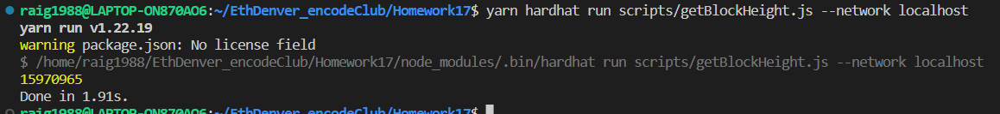
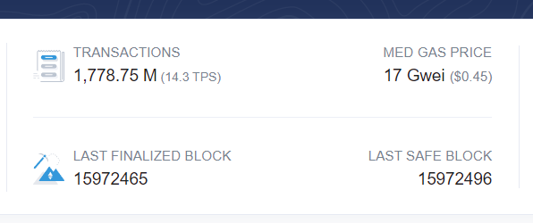
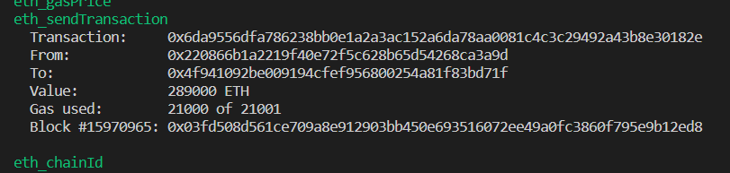

# Homework 17
## Create a fork of mainnet (details below)
### On the command line check the current block height, is this what you expected ? </br>
After running the local blockchain, on a separate terminal we can run the following command:
- yarn hardhat run scripts/getBlockHeight.js --network localhost </br>
That file contains the following code:
```solidity
const { ethers} = require("hardhat");

async function getBlockHeight() {
    const latestBlock = (await ethers.provider.getBlock("latest")).number
    console.log(latestBlock);
    // result "15970964"
}

getBlockHeight()
    .then(() => process.exit(0))
    .catch((error) => {
        console.error(error);
        process.exit(1);
    })
```
</br>
</br>
</br>
That result is similar to the latest block on Etherscan at similar request moments. </br>
</br>


### Can you transfer ETH from one of Vitalik's accounts to your own account ?
- We also write a script on hardhat.
``` solidity
const {ethers} = require("hardhat");

// Get Vitalik account - address 0x220866B1A2219f40e72f5c628B65D54268cA3A9D
async function runBlockchain() {
    console.log("Before transfer...");
    console.log("-------------------------------------")
    const vitalikAccount = await ethers.getImpersonatedSigner("0x220866B1A2219f40e72f5c628B65D54268cA3A9D");
    const vitalikBalance = await vitalikAccount.getBalance();
    console.log("Vitalik balance :", vitalikBalance);
    // get team 16 account balance
    const team16Account = await ethers.getImpersonatedSigner("0x4f941092be009194CFef956800254A81F83bd71f");
    const team16AccountBalance = await team16Account.getBalance();
    console.log("team16 balance: ", team16AccountBalance);
    // transfer
    const transactionResponse = await vitalikAccount.sendTransaction(
        {to: team16Account.address,
        value: ethers.utils.parseEther("289000"),
        });
    console.log("Transferring...")
    await transactionResponse.wait(1);
    console.log("------------------------------------")
    console.log("New balances after transfer...")
    const newVitalikBalance = await vitalikAccount.getBalance();
    const newTeam16Balance = await team16Account.getBalance();
    console.log("Vitalik new balance: ", newVitalikBalance);
    console.log("team16 new balance: ", newTeam16Balance);

}

runBlockchain()
    .then(() => process.exit(0))
    .catch((error) => {
        console.error(error);
        process.exit(1);
    })
```
Similar to the previous task, we need the local blockchain running on a different terminal. The we run the script with the following command: </br>
- yarn hardhat run scripts/impersonate.js --network localhost </br>

</br>

## Creating a fork of mainnet
- See also lesson 9
- See hardhat documentation
You first need to have an account on Infura or Alchemy
This will give you a key so that you can use their RPC nodes.
### Forking using ganache
npx ganache-cli --f https://mainnet.infura.io/v3/<your key> -m
“your 12 word mnemonic” --unlock <address> -i <chain ID>
### Fork from hardhat
In hardhat you can also specify this in the config file
npx hardhat node --fork https://ethmainnet.alchemyapi.io/v2/<your key>
networks: {
 hardhat: {
 forking: {
 url: "https://eth-mainnet.alchemyapi.io/v2/<key>",
 }
 }
}